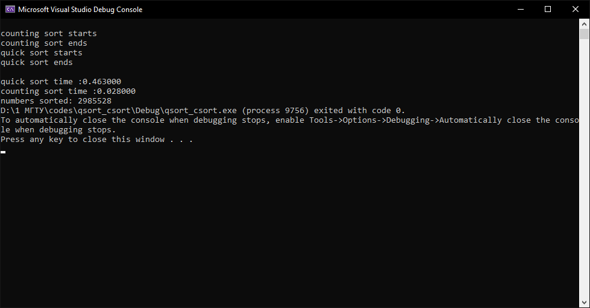
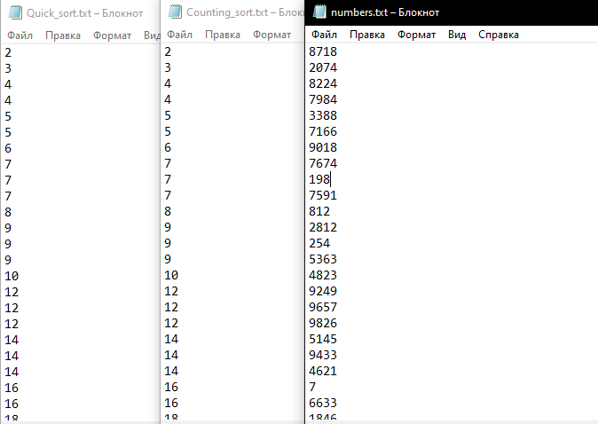

# Сортировка подсчетом и Быстрая сортировка 

## Домашнее задание для команды 4

### csort_qsort


### Explanation of the algorithm of the code:
Программа считывает массив целочисленных чисел из файла **numbers.txt** и записывает его в диномический массив **arr** длины **length**.
```c   
  FILE* file;
  if ((file = fopen("numbers.txt", "r")) == NULL) {
        printf("Cannot open file.\n");
        exit(1);
    }
    char buffer = getc(file);
    while (buffer != EOF) {
        if (buffer != '\n') {
            n++;
            number = (char*)realloc(number, (n) * sizeof(char));
            *(number + n - 1) = buffer;
        }
        else {
            n++;
            number = (char*)realloc(number, (n) * sizeof(char));
            *(number + n - 1) = '\0';
            length++;
            arr = (int*)realloc(arr, (length) * sizeof(int));
            sscanf(number, "%d", (arr + length - 1));
            n = 0;
            number = (char*)realloc(number, (n + 1) * sizeof(char));
        }
        buffer = getc(file);
    }

```
После чего вызывается функция сортировки методом подсчета **counting_sort**
```c
int counting_sort(int* arr, int length) {
    clock_t begin_counting = clock();
    int max = arr[0];
    int min = arr[0];
    int i;
    for (i = 1; i < length; i++) {
        if (arr[i] > max) {
            max = arr[i];
        }
        if (arr[i] < min) {
            min = arr[i];
        }
    }

    max++;
    FILE* Sortfile;

    if ((Sortfile = fopen("Counting_sort.txt", "w")) == NULL) {
        printf("Cannot open file.\n");
        exit(1);
    }
    int* tnuoc = (int*)malloc(sizeof(int));
    if (min < 0) {
        int r = 0;
        min = -min++;
        for (i = 0; i < min; i++) {
            r++;
            tnuoc = (char*)realloc(tnuoc, (r) * sizeof(int));
            tnuoc[i] = 0;
        }
        for (i = 0; i < length; i++) {
            if (arr[i] < 0) {
                tnuoc[-arr[i]]++;
            }
        }
    }

    int* count = (int*)malloc((max) * sizeof(int));
    for (i = 0; i < max; i++) {
        count[i] = 0;
    }
    for (i = 0; i < length; i++) {
        if (arr[i] >= 0) {
            count[arr[i]]++;
        }
    }
    clock_t finish_counting = clock();
   for (i = min; i > 0; i = i - 1) {
        if (tnuoc[i] != 0) {
            for (int j = 0; j < tnuoc[i]; j++) {
                fprintf(Sortfile, "%d\n", -i);
            }
        }
   } 
    for (i = 0; i < max; i++) {
        if (count[i] != 0) {
            for (int j = 0; j < count[i]; j++) {
                fprintf(Sortfile, "%i\n", i);
            }
        }
    }
    clock_t counting_time = finish_counting - begin_counting;
    return(counting_time);
}
```
Далее вызывается функция быстрой сортивки **quick_sort**, что уместно делать после сортировки методом подсчета, поскольку она является устойчивой, а значет не меняет относительного порядка сортируемых элементов.
```c
int quick_sort(int* arr, int lo, int hi) {
    if (lo >= 0 && hi >= 0 && lo < hi) {
        int p = swaping(arr, lo, hi);
        quick_sort(arr, lo, p);
        quick_sort(arr, ++p, hi);

    }
}
```
имеющая в себе вспомогательную функцию **swaping**
```c   
int swaping(int* arr, int low, int high) {
    int i, j, num_buffer;
    i = low;
    j = high;
    int pivot = arr[(i + j) / 2];
        while (1) {
            while ((arr[i]) < pivot) {
                i++;
            }
            while ((arr[j]) > pivot) {
                j--;
            }
            if (i >= j) {
                return j;
                break;
            }
            num_buffer = *(arr + j);
            *(arr + j) = *(arr + i);
            *(arr + i) = num_buffer;
            i++;
            j--;
        }
}
``` 
После завершения двух сортировок, а так же записи результата их работы в отдельные файлы **Counting_sort.txt** и **Quick_sort.txt** в консоли мы увидем информацию о том, сколько времени было затрачено каждым из алгаритмов и сколько чисел были отсортированы.

Результат работы программы:

